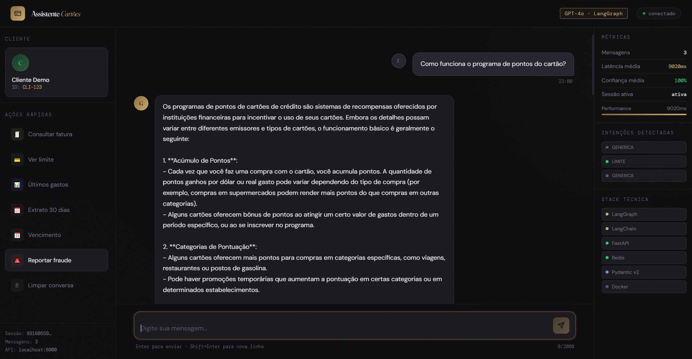
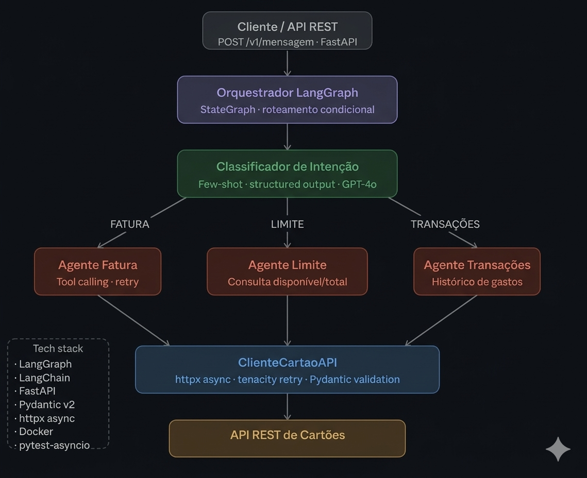

# 🃏 Assistente de Cartões IA



> Sistema de agentes de IA conversacional para operações de cartão de crédito, desenvolvido com LangGraph, LangChain e FastAPI.

## Arquitetura



## Visão Geral

Este projeto implementa um **assistente digital especializado em cartões de crédito**, composto por agentes de IA orquestrados via grafo de estados. O sistema identifica automaticamente a intenção do usuário e direciona a conversa para o agente mais adequado — fatura, limite ou transações — buscando dados reais via API REST.

```
Usuário → FastAPI → Orquestrador (LangGraph) → Classificador de Intenção
                                                        ↓
                            ┌───────────────────────────┼───────────────────────────┐
                      Agente Fatura           Agente Limite           Agente Transações
                            └───────────────────────────┼───────────────────────────┘
                                                        ↓
                                              ClienteCartaoAPI (httpx + retry)
                                                        ↓
                                              API REST de Cartões
```

## Stack Técnica

| Camada | Tecnologia |
|--------|-----------|
| Orquestração de agentes | LangGraph `StateGraph` |
| Framework de LLM | LangChain + ChatOpenAI (GPT-4o) |
| API REST | FastAPI + Pydantic v2 |
| HTTP Client | httpx (async) + tenacity (retry) |
| Memória de sessão | Redis (repositório abstrato) |
| Observabilidade | structlog (JSON estruturado) |
| Testes | pytest-asyncio + unittest.mock |
| Containerização | Docker multi-stage + docker-compose |

## Estrutura do Projeto

```
assistente_cartoes/
├── agentes/
│   ├── orquestrador.py          # LangGraph StateGraph com roteamento condicional
│   ├── classificador_intencao.py # Few-shot + structured output
│   ├── agente_fatura.py         # Tool calling com retry
│   ├── agente_limite.py         # Consulta e alertas de limite
│   └── agente_transacao.py      # Histórico e filtros de gastos
├── ferramentas/
│   └── cliente_cartao_api.py    # Repository pattern + httpx + tenacity
├── modelos/                     # Domain models Pydantic v2
├── servicos/
│   ├── api.py                   # FastAPI + lifespan + DI
│   ├── repositorio_memoria.py   # Redis/InMemory (abstraído)
│   └── observabilidade.py       # Middleware + structlog JSON
├── config/
│   └── configuracoes.py         # pydantic-settings + .env
├── testes/
│   ├── test_agentes.py          # Testes unitários com AsyncMock
│   └── test_integracao.py       # Testes de integração da API
├── Dockerfile                   # Multi-stage, non-root user, healthcheck
├── docker-compose.yml           # Redis + MockServer + App
└── pyproject.toml               # pytest, ruff, mypy
```

## Como Executar

### Com Docker Compose (recomendado)

```bash
cp .env.example .env
# Adicione sua OPENAI_API_KEY no .env
docker-compose up --build
```

### Localmente

```bash
python -m venv .venv && source .venv/bin/activate
pip install -r requirements.txt
uvicorn servicos.api:app --reload
```

## Exemplo de Uso

```bash
curl -X POST http://localhost:8000/v1/mensagem \
  -H "Content-Type: application/json" \
  -d '{"mensagem": "qual o valor da minha fatura?", "id_cliente": "CLI-123"}'
```

```json
{
  "id_sessao": "3f2d1a9b-...",
  "resposta": {
    "texto": "Sua fatura de janeiro é de R$ 1.500,00, vencendo em 10/02/2025.",
    "intencao": "CONSULTA_FATURA",
    "confianca": 0.97
  }
}
```

## Testes

```bash
pytest testes/ -v
```

## Decisões de Design

**Por que LangGraph?** O grafo de estados explicita o fluxo de decisão, torna a adição de novos agentes declarativa e facilita debugging e testes. A alternativa (LangChain LCEL linear) não suporta roteamento condicional com estado compartilhado.

**Por que structured output no classificador?** Evita parsing frágil de strings e garante que a LLM retorne sempre um dos valores válidos do enum `IntencaoUsuario`. A falha resulta em exceção tipada, não silenciosa.

**Por que tenacity no cliente HTTP?** APIs parceiras são instáveis. Backoff exponencial com máximo de 3 tentativas evita cascatas de falha sem sobrecarregar o parceiro. O padrão decorator mantém o retry separado da lógica de negócio.

**Por que repositório abstrato para memória?** Produção usa Redis; testes e desenvolvimento local usam `RepositorioMemoriaEmMemoria`. Trocar a implementação não exige nenhuma alteração nos agentes — apenas no `lifespan` da API.

## Variáveis de Ambiente

| Variável | Padrão | Descrição |
|----------|--------|-----------|
| `OPENAI_API_KEY` | — | Chave da API OpenAI (obrigatório) |
| `MODELO_LLM` | `gpt-4o` | Modelo a ser utilizado |
| `URL_API_CARTOES` | `https://api.cartoes.com` | URL base da API parceira |
| `REDIS_URL` | `redis://localhost:6379` | URL de conexão Redis |
| `NIVEL_LOG` | `INFO` | Nível de logging |
